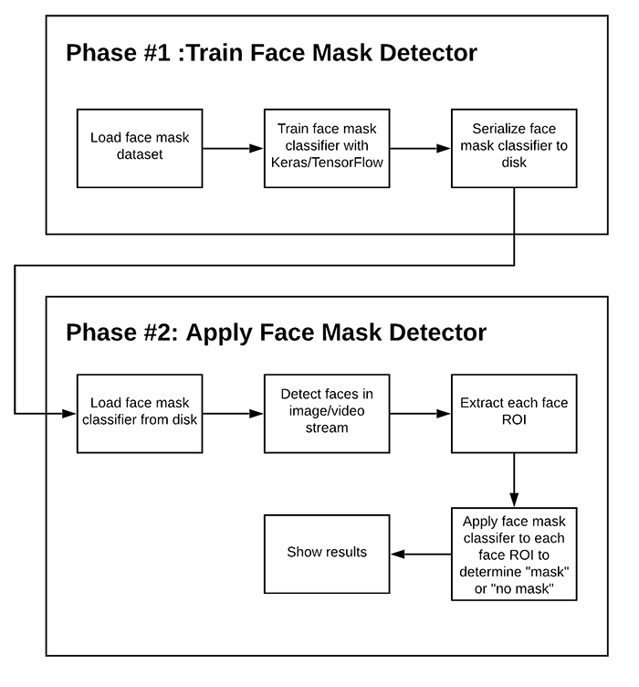

# Mast Detection Deep Learning COVID 19

To run on your system, first clone the repository and then type in the command line:  
</t> ` python detect_mask_video.py `
 

The face detection is done by extracting ROI (region of interest) using  ` cv2.dnn.readNetFromCaffe`
 
## Workflow

